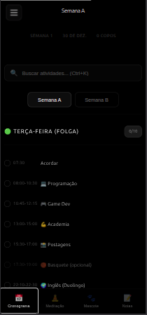
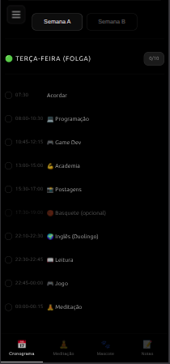
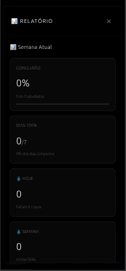
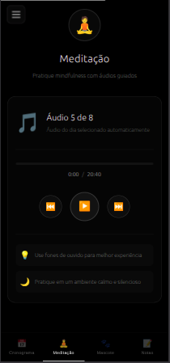
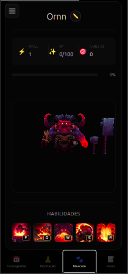
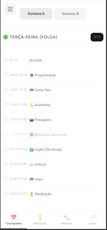
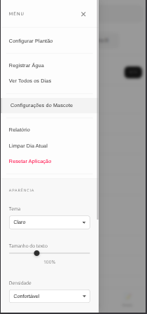

# Cronograma 12x36

**Um assistente pessoal inteligente para gerenciar rotinas alternadas de trabalho em escala 12x36**



## O Problema

Escalas de trabalho 12x36 criam um desafio único de organização. Ao invés de uma rotina linear de segunda a sexta, você alterna entre dias de trabalho intenso e dias de folga, cada um com seu próprio conjunto de responsabilidades e objetivos.

Dias de plantão exigem foco no trabalho, controle de hidratação durante longas jornadas, e autocuidado após o expediente. Dias de folga abrem espaço para academia, estudos, projetos pessoais e hobbies que ficam pausados durante os plantões.

**A maioria dos aplicativos de produtividade não foi projetada para esse tipo de rotina.** Ou você configura manualmente suas tarefas todos os dias, ou acaba vendo uma lista de atividades que não faz sentido para o contexto atual.

Este projeto resolve esse problema específico: um gerenciador de tarefas que entende escalas alternadas e se adapta automaticamente ao tipo de dia.

## Como Funciona

### Detecção automática de contexto
Configure uma única vez a data inicial do seu plantão. A partir daí, o sistema calcula automaticamente se hoje é dia de trabalho ou folga (Semana A ou B) e exibe apenas as atividades relevantes.



### Sistema de tarefas contextual
- Duas configurações de semana (A e B), cada uma com atividades específicas
- Separação entre dias de trabalho e dias de folga
- Checkboxes persistentes que resetam automaticamente à meia-noite
- Cálculo de progresso diário e semanal
- Relatórios com métricas de conclusão, streaks e estatísticas históricas



### Gestão de hidratação
Notificações programadas a cada 30 minutos durante o dia para lembrar de beber água. Contador visual de copos consumidos com persistência semanal.

### Player de meditação
Interface com 8 áudios de meditação que rotacionam automaticamente usando a fórmula `(dayOfYear % 8) + 1`. Abra o app antes de dormir e o áudio correto já estará selecionado.



### Sistema de gamificação
Mascote virtual com sistema de experiência e níveis. Complete tarefas para ganhar XP, suba de nível, desbloqueie conquistas. Integração completa com o sistema de relatórios.



### Notas rápidas
Bloco de anotações embutido para capturar pensamentos sem sair do contexto do aplicativo.

## Interface Adaptável

O aplicativo oferece personalização completa da experiência visual:



**Temas disponíveis**
- Automático (segue o sistema operacional)
- Escuro (padrão, ideal para trabalho noturno)
- Claro (para ambientes bem iluminados)

**Ajustes de acessibilidade**
- 4 níveis de tamanho de fonte
- 3 níveis de densidade de interface (compacto/confortável/espaçoso)
- Alto contraste em ambos os temas

## Arquitetura

**Progressive Web App completo**
- Funciona offline através de Service Worker
- Instalável como aplicativo nativo (iOS/Android/Desktop)
- Notificações push para lembretes
- Armazenamento local com localStorage

**Tecnologias**
- HTML5 semântico
- CSS3 com sistema completo de theming (claro/escuro/auto)
- JavaScript ES6+ modular
- Zero dependências externas

**Decisões de design**

Por que não usar um framework? Este projeto valoriza simplicidade, controle total e portabilidade. Sem build steps, sem node_modules de 500MB, sem breaking changes a cada major version. Abra qualquer arquivo e entenda exatamente o que está acontecendo.

A arquitetura modular divide responsabilidades em 9 módulos independentes: `cycle-system` para cálculos de escala, `activities` para gerenciamento de tarefas, `reports` para estatísticas, `pet-system` para gamificação, etc. Cada módulo tem um propósito claro e pode ser modificado isoladamente.

## Estrutura do Projeto

```
src/
├── css/
│   ├── style.css          # Estilos base
│   └── redesign.css       # Sistema de design modular
├── js/
│   ├── app.js            # Entry point
│   └── modules/
│       ├── activities.js            # Gerenciamento de tarefas
│       ├── cycle-system.js          # Cálculos de escala 12x36
│       ├── dom-elements.js          # Referências DOM
│       ├── menu.js                  # Menu lateral
│       ├── mobile-view.js           # Views responsivas
│       ├── notifications.js         # Sistema de lembretes
│       ├── reports.js               # Analytics e relatórios
│       ├── tabs-manager.js          # Navegação SPA
│       ├── meditation-player.js     # Player de áudio
│       ├── pet-system.js           # Gamificação
│       └── weekly-cleanup.js       # Reset automático
└── assets/
    ├── icon-*.svg        # Ícones PWA
    └── meditacao/        # Áudios de meditação
```

**Dados privados**
Toda informação permanece no dispositivo. Sem servidores, sem tracking, sem sincronização na nuvem. Você controla seus dados.

## Versão Mobile

Progressive Web App completo com experiência nativa:



- Instalável na tela inicial (iOS/Android)
- Funciona offline
- Notificações push
- Interface otimizada para toque
- Navegação por tabs

## Executar Localmente

```bash
# Qualquer servidor HTTP funciona
python3 -m http.server 8000

# Acesse em http://localhost:8000
```

Ou use a extensão Live Server do VS Code para hot reload durante desenvolvimento.

## Reflexões

Este projeto surgiu de uma frustração genuína: nenhuma ferramenta existente entendia o problema específico de escalas 12x36. Poderia ter me adaptado a alguma solução genérica, mas decidi construir exatamente o que precisava.

O resultado é uma ferramenta que uso diariamente há meses. Não é perfeita, tem peculiaridades e decisões opinionadas, mas resolve o problema real que me motivou a criá-la.

**É um MVP no verdadeiro sentido:** Minimum Viable Product que entrega valor real. O código não é enterprise-grade, tem gambiarras aqui e ali, mas funciona consistentemente e se encaixa no meu fluxo de trabalho.

Se você trabalha em escala alternada e sofre com os mesmos problemas, talvez encontre valor aqui. Se é desenvolvedor curioso sobre PWAs ou arquitetura modular sem frameworks, pode ser um estudo de caso interessante.

## Licença

MIT - Use, modifique e distribua livremente.
